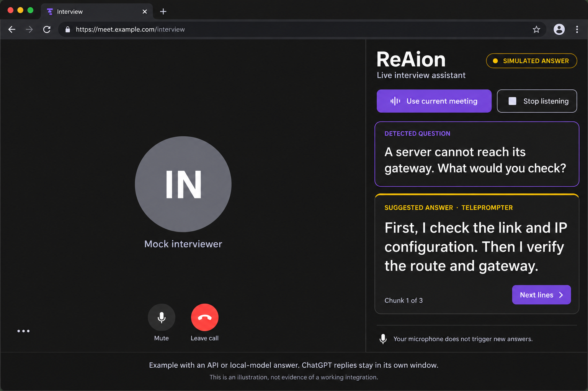

# ReAion

**ReAion** (reh-ah-yon) · **ראיון** — Hebrew for interview. Hosted in the **ReyAi** repository.

ReAion is an interview-assistant project designed to keep the meeting visible while a side panel shows the interviewer's question and a readable suggested answer. A microphone-following teleprompter presents the answer in short chunks, helping you keep your place while speaking.

The interface uses a charcoal base with violet primary actions and a focused
amber accent for active status and teleprompter progress.

**Current release: 0.2.0 development source.** The Chrome extension requires a local Python companion. Live meeting audio and signed-in AI automation have not passed an end-to-end test; one-click installation is still planned.

[Developer setup](ReAion/README.md) · [Verified project state](ReAion/PROJECT_STATE.md) · [Roadmap](ReAion/ROADMAP.md)

## Example layout



**AI-generated illustrative mockup, not an actual application screenshot.** It shows the intended side-by-side experience with simulated content. API and local-model engines can return answers to the custom panel; the experimental ChatGPT integration leaves replies in ChatGPT's own window. The illustration is not evidence of a working live integration.

To view the **actual implemented panel** with synthetic content, run `python mock_interview.py --serve` from the `ReAion` directory. This requires no AI account or audio devices. Stop any running watcher first; both use port 8765.

## What the tool does

- **Keeps the answer prominent.** A large detected question and short answer chunks take priority over the transcript.
- **Processes interviewer speech automatically.** Local transcription feeds question segmentation and answer generation, without an Ask click for each question.
- **Separates candidate speech.** Candidate microphone transcripts advance the teleprompter and do not enter question detection. A Next lines control provides manual progression.
- **Uses personal context you supply.** Local profile, answer-bank and interview-guidance files provide grounding for prompts. Shared source contains blank/example material, not a user's resume.
- **Offers multiple answer engines.** Browser/desktop AI automation, API adapters and an optional local model are available at different stages of readiness.
- **Shows compact session status.** The panel reports listening, processing, errors and answer state. External AI submission is distinguished from a locally available answer.

These components exist in the source; reliable real-world operation still needs the live tests listed below.

## Browser interview workflow

1. Start the local companion and open your interview in Chrome.
2. Open the ReAion extension panel and choose **Use current meeting**. This selects the current HTTPS meeting tab without editing `interviews.json`.
3. Join the meeting yourself. Detection looks for active-call controls before starting capture; ReAion does not click Join.
4. Interviewer audio is transcribed locally, segmented into prompts and sent to the selected answer engine.
5. Read the answer in the custom teleprompter when the engine returns text, or in the external AI window when using UI automation.
6. Select **Stop listening** or leave the call to end capture; verify that it stops during your rehearsal.

The current capture path uses **system-wide playback audio**, not isolated Chrome-tab audio. Other playback and speaker echo can contaminate the interviewer channel. Use headphones and test on your own machine.

Meeting control adapters cover Google Meet, Teams, Zoom, Webex and Chime, with a generic selected-tab fallback. These are implementation targets with fixture tests, not a guarantee that every provider's current interface works. Microphone enabling is attempted once after selected-call detection; later manual mute is respected. Camera activation requires an explicit prompt.

## Answer engines

| Engine | Where the answer appears | Current requirements and limits |
| --- | --- | --- |
| ChatGPT browser | ChatGPT's own window | Experimental visible UI automation; you sign in yourself in a dedicated browser profile. No automatic reply import into the teleprompter. |
| ChatGPT Windows / Claude desktop | The AI application's window | Experimental Windows UI automation; requires the application and your signed-in session. |
| OpenAI-compatible API | ReAion panel | API endpoint, model and credentials; separate provider billing may apply. |
| Anthropic API | ReAion panel | API credentials and model configuration; separate from a Claude chat subscription. |
| Ollama | ReAion panel | Local Ollama server and downloaded model; performance depends on your hardware. |
| Built-in fallback | ReAion panel | Generic guidance, not a substitute for a personalized AI answer. It does not make a failed provider health check pass. |

API and local-model adapters require configuration and live validation. See [settings](ReAion/assistant_settings.json), [environment-variable examples](ReAion/.env.example) and [local AI notes](ReAion/LOCAL_AI.md).

**Signing into ChatGPT does not load all your chats, resume or account history into ReAion.** The project does not extract credentials, authentication tokens or browser cookies, and does not call private ChatGPT APIs. Browser UI automation is experimental, not a supported ChatGPT integration API.

## Languages and answer presentation

Transcription uses `faster-whisper`, with `large-v3-turbo` as the configured default and automatic language detection or an explicit language setting. The panel uses automatic text direction for content such as Hebrew. Multilingual fixtures are tested; live recognition accuracy and latency are not yet verified.

Question completion is heuristic, using transcript boundaries and punctuation. It is not restricted to a list of question-starting words, but it can still split a long prompt or mistake small talk for a request. Teleprompter chunks follow words, not a guaranteed fixed number of screen lines; wrapping depends on panel width.

## Try the actual panel

From a local checkout, open `ReAion/ReAion.code-workspace` in VS Code, or run:

```sh
cd ReAion
python mock_interview.py
python mock_interview.py --serve
```

The first command checks the synthetic question → fixture answer → panel state → spoken-progress pipeline. The second serves the real panel at `http://127.0.0.1:8765`. Use **Next lines** to advance the simulated answer. Stop with **Ctrl+C**.

For microphone capture and AI setup, follow the [developer installation instructions](ReAion/README.md#developer-setup-and-real-meet-test). Windows batch scripts must be run directly, not with `py filename.bat`. The current distribution requires developer setup and loading an unpacked Chrome extension.

## Platforms and verification

| Area | Status |
| --- | --- |
| Chrome extension + local companion | Implemented; fixture and HTTP tests pass; real meeting flow unverified. |
| Windows | Audio, volume, window and launcher integration code exists; native live validation remains. |
| Linux / macOS | Shared core and platform guards exist; capture, permissions and desktop behavior remain experimental. |
| Desktop distribution | Optional desktop view and Windows build recipes exist; no tested EXE, DMG or AppImage is supplied. |
| Automated checks | 42 Python tests, deterministic mock pipeline, Node extension fixtures and Python syntax checks passed in the development environment. |

Run component checks from `ReAion/`:

```sh
python -m unittest discover -s tests -v
python mock_interview.py
node tests/test_extension_runtime.cjs
python -m compileall -q .
python health_check.py
```

A failing selected provider returns a failed health result. Component tests do not verify real audio, account login, provider responses or installer readiness. Before relying on a live session, rehearse with a second participant and verify capture, question completion, AI submission, answer display, candidate-speech isolation and shutdown. See [exact evidence and remaining blockers](ReAion/PROJECT_STATE.md).

## Personal data and privacy

Run `python setup_private_profile.py` to create private templates. Profiles, schedules and runtime data use a per-user directory, kept outside shared source:

| Platform | Default location |
| --- | --- |
| Windows | `%LOCALAPPDATA%\InterviewCopilot` |
| macOS | `~/Library/Application Support/InterviewCopilot` |
| Linux | `$XDG_DATA_HOME/InterviewCopilot`, or `~/.local/share/InterviewCopilot` |

The historical `InterviewCopilot` directory name and `INTERVIEWCOPILOT_DATA_DIR` override remain for upgrade compatibility. They do not indicate a second maintained application.

Recordings and transcripts remain local, and **recording is currently enabled by default**. Retention controls and an opt-in recording policy are still pending. Text prompts and supplied context go to your selected remote AI service when using a remote engine. Keep credentials in your local environment and never commit runtime data, recordings, browser profiles or secrets.

## What is next

The next release work is real browser/audio/AI validation, followed by reliable installation and onboarding. Selected-tab audio capture, full preflight checks, Google Calendar/Gmail OAuth discovery, interviewer preparation attachments, recording retention and production multi-user support remain on the [roadmap](ReAion/ROADMAP.md).

## Repository guide

The maintained source lives in **[ReAion/](ReAion/)**. Old distributions and obsolete prototype files were removed; Git history preserves earlier versions.

| Location | Purpose |
| --- | --- |
| `ReAion/chrome_extension/` | Meeting selection, browser controls and answer panel |
| `ReAion/live_session.py` | Shared session controller |
| `ReAion/meet_transcriber.py` | Local audio/transcription path |
| `ReAion/answer_providers.py` | Answer-engine routing |
| `ReAion/teleprompter.py` | Answer chunking and spoken progress |
| `ReAion/tests/` | Component and regression tests |
| `ReAion/PROJECT_STATE.md` | Verified behavior, limitations and exact next step |

Read [AGENTS.md](ReAion/AGENTS.md) before changing code. Preserve the provider-independent core and keep claims tied to actual test evidence.
