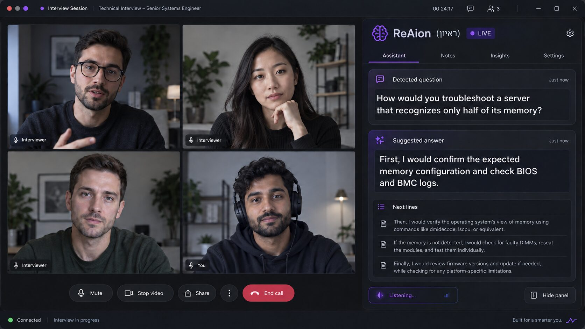

# ReAion

ReAion (ראיון) is a live interview-assistant project. It keeps the interview visible while showing the detected question and a large suggested answer in a side panel / teleprompter.

The UI uses a dark-grey background with violet accents. The previous yellow/amber palette has been removed.

## What the tool does

- Listens to the interview and detects interviewer questions.
- Generates suggested answers automatically without requiring an Ask button for every question.
- Shows the detected question and answer in a large, readable side panel.
- Advances the teleprompter as the candidate speaks, with manual Next lines control as a fallback.
- Supports multilingual interviews, including Hebrew.
- Is designed to work with browser and desktop meeting platforms such as Google Meet, Microsoft Teams, Zoom, Webex and Amazon Chime.
- Can use different answer providers, including ChatGPT-style browser/desktop workflows, APIs and optional local models.
- Can use a candidate profile, answer bank and interview guidance as context.

*Example of the interview and ReAion answer panel displayed side by side.*

## Repository guide

The maintained project is under `ReAion/`.

| Location | Purpose |
| --- | --- |
| `ReAion/chrome_extension/` | Browser side panel and meeting integration |
| `ReAion/live_session.py` | Main live-session controller |
| `ReAion/meet_transcriber.py` | Audio capture and transcription |
| `ReAion/answer_engine.py` / `answer_providers.py` | Answer generation and provider routing |
| `ReAion/interview_assistant_gui.py` | Desktop answer-panel UI |
| `ReAion/teleprompter.py` | Answer chunking and progression |
| `ReAion/tests/` | Automated tests |
